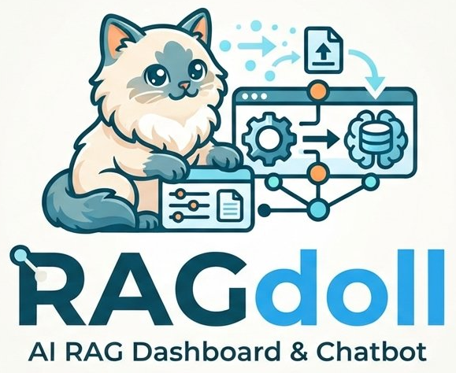

# RAGdoll

**AI RAG Dashboard & Chatbot** — build a retrieval-augmented generation pipeline,
evaluate it, and chat with your own PDFs. No code required.

RAGdoll is a RAG pipeline workbench: pick a provider, drop in up to three PDFs,
tune chunking and retrieval, and the app assembles the index, scores it with
Ragas-style metrics, and answers questions with page-level citations.

<p align="center">
  
</p>

## What it does

| Route | Purpose |
| --- | --- |
| `/` | Project overview and licensing. |
| `/create` | Configure the provider, models, chunking and retrieval; build the index. |
| `/evaluate` | Run the eight-metric Ragas suite. Disabled until a pipeline exists. |
| `/chat` | Cited, grounded chat. Disabled until a pipeline exists. |

- **Four providers** — OpenAI, Vocareum, DeepSeek, Ollama/llama.cpp (self-hosted).
- **Six embedding models** with their vector widths resolved automatically.
- **Context injection or agentic retrieval**, chosen per pipeline.
- **Groundedness gate** — a Ragas `faithfulness` pass discards unsupported answers
  and emits *"Sorry, I don't know the answer to that."* instead.
- **Citation-first streaming** — sources arrive before the first token.
- **Nothing on disk** — the pipeline, PDFs, citations and chat live server-side in
  the session (15-minute sliding TTL) and are dropped when it expires.

## Architecture

```
browser ──▶ Next.js 15 (App Router, Server Actions, BFF)
              │  session: signed __Host-ragdoll-sid id cookie → server-side store
              │  store: process memory, mirrored to Upstash/Vercel KV when configured
              │  key: held in the session, never in the cookie
              ▼  bearer token (never exposed to the browser)
           FastAPI engine  ──▶  LLM + embedding provider
              │  PDF sandbox, chunker, in-memory vector index, Ragas-style metrics
              ▼
           SSE  ──▶  Next.js Route Handler  ──▶  AI SDK v5 data stream  ──▶  useChat
```

The cookie is an opaque, HMAC-signed session id — a handle, not a container — so
its size does not grow with the session. Everything else lives in the server-side
store, exactly as AGENTS.md specifies.

Two runtimes, one Vercel project, declared in `vercel.json` with
[Services](https://vercel.com/docs/services/experimental). See
[DEPLOYMENT.md](DEPLOYMENT.md).

## Repository layout

```
web/                Next.js 15 app (App Router, React 19, TailwindCSS)
  src/app/          routes, Server Actions, the chat streaming bridge
  src/lib/          session, crypto, provider table, validation, i18n
  src/components/   UI, chat, creation form, evaluation dashboard
  e2e/              Playwright specs (shell + full pipeline journey)
api/                FastAPI engine
  app/              pdf, chunking, distance, prompts, rag, evaluate, guardrails
  tests/            pytest suite with a deterministic provider double
  tools/            openapi export, end-to-end HTTP smoke test
tools/              brand asset pipeline (logo → avatar, icons)
```

## Local development

```bash
pnpm install

# 1. the engine
python -m venv .venv
.venv/Scripts/activate            # Windows; source .venv/bin/activate elsewhere
pip install -r api/requirements.txt
RAGDOLL_DEV_PROVIDER=1 RAGDOLL_API_TOKEN=dev-token \
  python -m uvicorn app.main:app --reload --port 8000 --app-dir api

# 2. the app
cp web/.env.example web/.env.local   # then set RAGDOLL_API_URL=http://127.0.0.1:8000
pnpm dev                             # http://localhost:3000
```

`RAGDOLL_DEV_PROVIDER=1` swaps in a deterministic offline provider, so the whole
pipeline — ingest, retrieval, citations, the groundedness gate, streaming and the
metric suite — runs with no API key and no network. It is refused on a hosted
deployment.

## Testing

```bash
pnpm lint        # ESLint
pnpm typecheck   # tsc --noEmit
pnpm test        # Vitest
pnpm e2e         # Playwright (shell always; the pipeline journey needs an engine)

cd api
ruff check . && ruff format --check .
mypy
pytest -q
```

The engine's HTTP surface has its own smoke test, run against a live server:

```bash
python api/tools/smoke.py http://127.0.0.1:8000 dev-token
```

## Configuration

| Variable | Where | Purpose |
| --- | --- | --- |
| `RAGDOLL_SESSION_SECRET` | web | ≥32 chars; signs the session cookie. |
| `RAGDOLL_API_TOKEN` | both | Shared secret between the bridge and the engine. Required when hosted. |
| `RAGDOLL_API_URL` | web | Base URL of the FastAPI engine. |
| `KV_REST_API_URL` / `KV_REST_API_TOKEN` | both | Optional shared session store (Upstash/Vercel KV). |
| `RAGDOLL_HOSTED` | both | `1` makes loopback providers fail fast with the self-hosting message. |
| `RAGDOLL_DEV_PROVIDER` | api | Offline deterministic provider; ignored when hosted. |
| `RAGDOLL_GROUNDEDNESS_THRESHOLD` | api | Faithfulness cut-off, default `0.5`. |

## License

MIT — see [LICENSE](LICENSE). © 2026 Harley Dangan. Submitted as a mini project to
the Asian Institute of Management.
